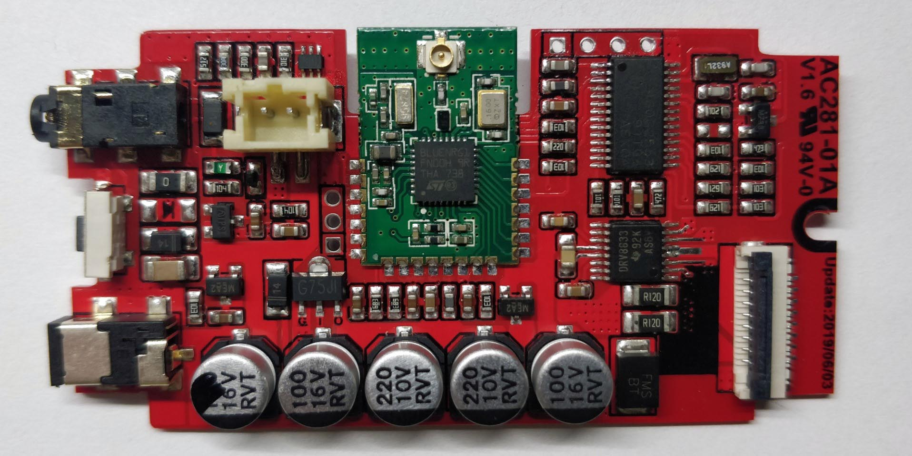
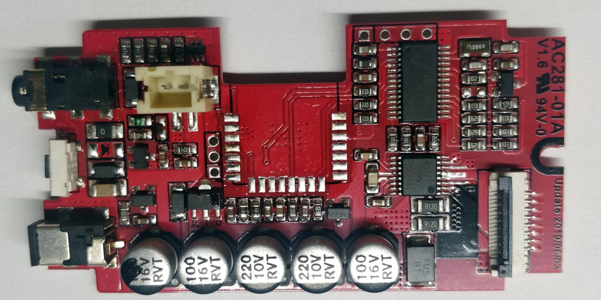
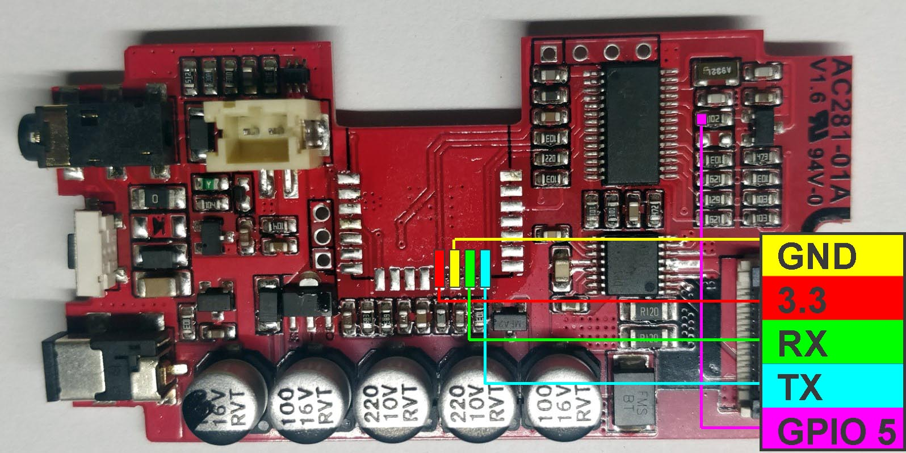
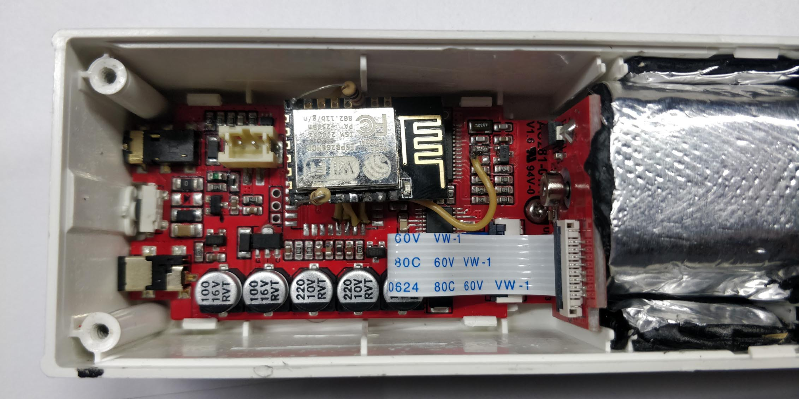
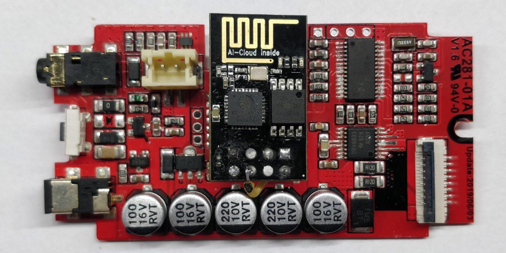

# AM43-WiFi
This project changes chinese AM43 blinds engine (like on image below) controls from BLE to WiFi MQTT using ESP8266 modules such as ESP-01 or ESP-12F

**Now with ESPHome version available**

*This is not same as AM43 cover component which is just WiFi<->BLE bridge, this is hardware conversion with removal of BLE module*


**This is hardware modification!**

Only problem I have noticed after modification that AM43 MCU hangs after couple of days and not responding to commands for unknown reason. So ESP8266 triggers MCU reset pin if there is no answer for 5 minutes, additional ESP8266 pin needed for this to work.

# You need
* Some adequate soldering and most important **desoldering** skills
* Knowledge of ESP8266 flashing mechanism using Arduino IDE (or ESPHome flasher in case of ESPHome version)
* ESP8266 module. I've used ESP-12F. You can use ESP-01 or others but there is some changes must be made to board pinout in code.

# Features (Arduino MQTT version)
- Control over WiFi using MQTT client
- OTA updates enabled
- WiFi Manager with WiFi and MQTT Settings
- Accepts actions (Open/Close/Stop)
- Accepts position input (0%-100%)
- Position tracking
- Battery level tracking
- Light level tracking
- Automatically resets blinds MCU if there is no response for some time (5 minutes)

# Features (ESPHome version)
- Control over component trough ESPHome configuration
- Accepts position input (0%-100%)
- Position tracking
- Battery level tracking
- Light level tracking
- Automatically resets blinds MCU if there is no response for some time (5 minutes)

# Installation
### Firmware (Arduino MQTT version)
1. Prepare ESP8266 board to use:
   1. For ESP-12F there is two 1k resistors needed between *EN* and *VCC* pins and between *GPIO15* and *GND*.
   2. Also for some modules to upload firmware over UART *GPIO0* must be connected to *GND*.
   3. **CHANGE PASSWORD for WiFi Manager and OTA Updates in code!** (single "passwd" constant in *ESP_AM43.ino*)
   3. Upload firmware to module trough UART.
   4. Done. Now you can upload firmware updates using Arduino OTA.
2. Connect flashed device to power.
3. If there is no WiFi settings stored on device, WiFi Manager will launch and blue LED will start blinking.
4. Connect to new WiFi access point named "ESP-AM43-(esp-mac-address)" using changed password from "passwd" constant.
5. Change WiFi and MQTT settings.
6. Firmware part is done.
### Firmware (ESPHome version)
Follow default ESPHome instalation procedure using provided config file.
### Hardware
1. Disassemble device

2. Desolder BLE module from main board

3. Solder ESP module pins using wires according to map:

4. Assemble device
   * ESP-12F result
   
   * ESP-01 result (without auto-reset functionality)
   
5. Also I've added some rubber sound-vibration damping material around motor and gearbox to reduce noise, this have improved device acoustics a lot! Now it's almost unnoticeable at night.

**Congratulations! Conversion is done!**
# MQTT Topics
Device topic variable can be changed in WiFi manager as **mqtt topic**, this is prefix for all provided topics. Default value is "am43-default", i.e. "/status" topic will be published to "am43-default/status".

Device publishes and listens to next MQTT topics:
* **/status**  
GET topic  
Device will publish it's birth message there on every update  
Message: "online"
* **/command**  
SET topic  
Device will receive commands from this topic  
Accepted commands (case insensitive):
  * STOP
  * OPEN/ON/UP
  * CLOSE/OFF/DOWN
* **/position/set**  
SET topic  
Device will receive position percent command from this topic  
Accepted values: 0-100
* **/position**  
GET topic  
Device will publish it's current position in percent there
* **/sensor**  
GET topic  
Device will publish it's battery and light sensor data in JSON format there  
JSON format:
  ```json
   {
   batt: 0-100,
   light: 0-3
   }
   ```
#### Home Assistant config example
```yaml
cover:
  - platform: mqtt
    device_class: shade
    name: "AM43 Shutter"
    command_topic: "am43-default/command"
    position_topic: "am43-default/position"
    set_position_topic: "am43-default/position/set"
    availability:
      - topic: "am43-default/status"
    qos: 0
    retain: true
    payload_open: "OPEN"
    payload_close: "CLOSE"
    payload_stop: "STOP"
    position_open: 0
    position_closed: 100
    payload_available: "online"
    payload_not_available: "offline"
    optimistic: false
    value_template: '{{ value }}'
    json_attributes_topic: "am43-default/sensor"

```

#### Afterword
There is some commented code in "am43.cpp" since i've implemented almost entire protocol for controlling timings and settings of AM43 MCU. But there is no need for it in this project, you can freely modify it as you want. Also *WEB_SOCKET_DEBUG* flag will help you with modifications, just use http://tzapu.github.io/WebSocketSerialMonitor/ to debug ESP over WiFi.
